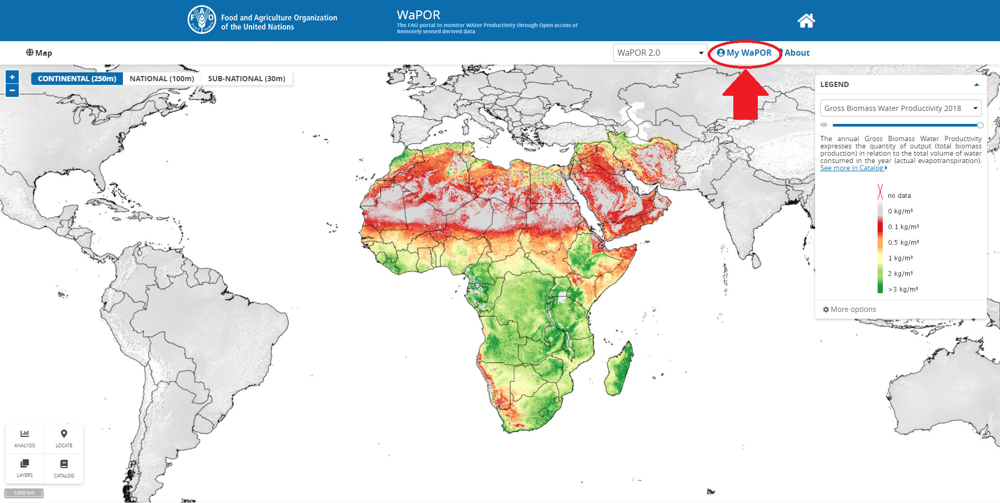
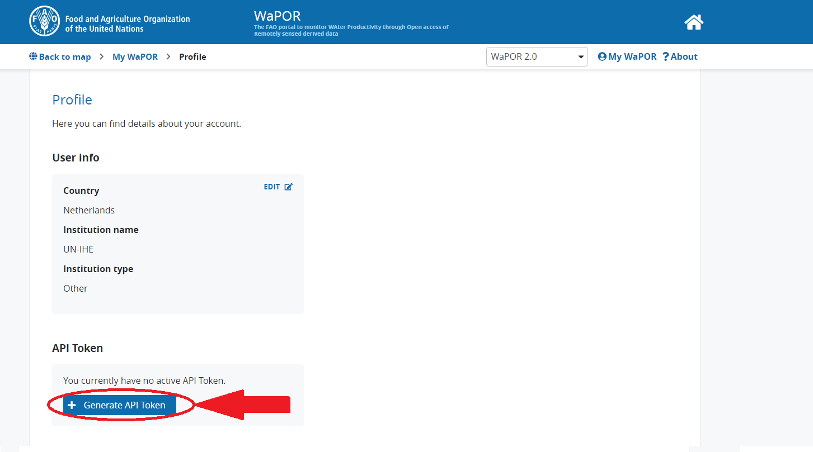

# WAPOR API

# Description:
This tool collects FAO's WAPOR data of LEVEL 1, LEVEL 2, and LEVEL 3 (excluding the seasonal paramters). The output will be tiff files and no conversions is 
preformed to the units. The output are in the same units as on the WAPOR Portal (https://wapor.apps.fao.org/home/1)

The following input is required:
    
    -- output_folder: (string) to define the folder where to save the created tiff files.
    -- Startdate: (string) defines the startdate of the required dataset in the following format "yyyy-mm-dd"
    -- Enddate: (string) defines the enddate of the required dataset in the following format "yyyy-mm-dd"
    -- Latlim: (array) defines the latitude limits in the following format [Latitude_minimum, Latitude_maximum] e.g. [10, 13]
    -- Lonlim: (array) defines the longitude limits in the following format [Longitude_minimum, Longitude_maximum] e.g. [10, 13]
    -- API_KEY: (string) this is a private API KEY that can be collected here: https://io.apps.fao.org/gismgr/api/v1/swagger-ui.html#/IAM/apiKeySignIn
    -- Parameter: (string) define the parameter that is required
    -- version: (string) default is 2, but if version 1 is required use this parameter (options are "1" or "2")
    
    Required for Level 3 data:
    -- Area: (string) defines the area of the parameter (options are "AWA", "BKA", "KOG", "ODN", or "ZAN")
    
To get a describtion of all the possible parameters type:
    
import WaporAPI

> WaporAPI.Collect.VariablesInfo.descriptions 

# Example LEVEL 1:

>import WaporAPI

>WaporAPI.Collect.WAPOR(r"G:\\...\\...", "2011-01-01", "2011-02-01", [8.2, 8.7], [39, 39.5], 'HERE_YOUR_PRIVATE_KEY', "L1_T_D")

# Example LEVEL 2:

>import WaporAPI

>WaporAPI.Collect.WAPOR(r"G:\\...\\...", "2011-01-01", "2011-02-01", [8.2, 8.7], [39, 39.5], 'HERE_YOUR_PRIVATE_KEY', "L2_T_D")

# Example LEVEL 3:

>import WaporAPI

>WaporAPI.Collect.WAPOR(r"G:\\...\\...", "2011-01-01", "2011-02-01", [8.2, 8.7], [39, 39.5], 'HERE_YOUR_PRIVATE_KEY', "L3_T_D", Area = "AWA")

# Get a WaPOR API Key

To create a Wapor Account go to FAO's WaPOR webpage: https://wapor.apps.fao.org/home/WAPOR_2/1. And push the Sign in button on the top right of the page. Create an account and sign in.

Go back to the portal page and now the sign in button is replaced by the My WaPOR button. Click on this button, to open your profile.

 

Select the "My Profile" option. And in the API Token section, you can generate an API Token by clicking on the "Generate API Token" button.

 

Save this API-KEY somewhere on your computer, this token is needed later to run the WaporTranslator. This token is private and you should not share this token with others!
